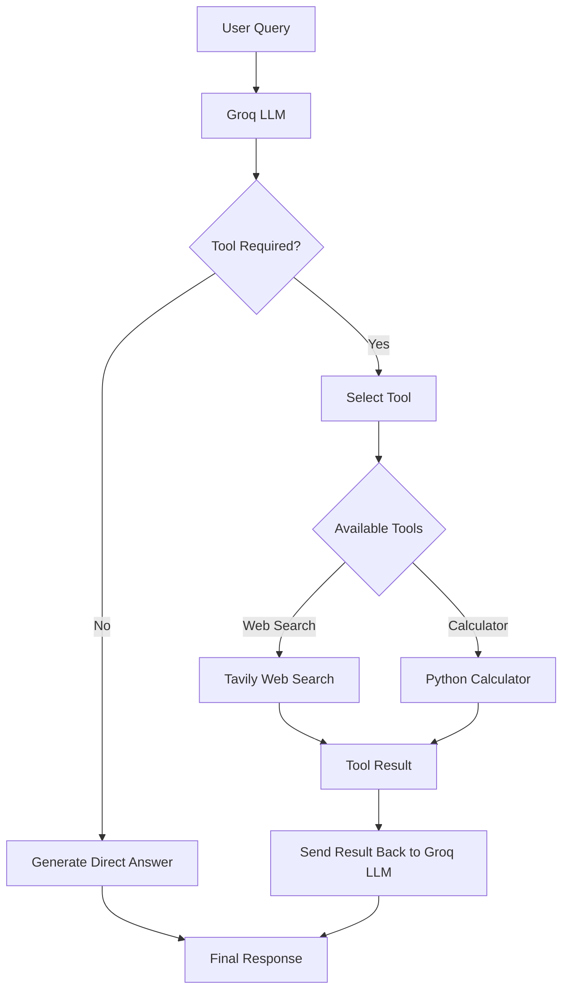

## AI Agent with Tool Calling

A lightweight AI Agent built with Python and Groq LLM that can dynamically use external tools based on the user's query. The agent supports real-time web search through Tavily and safe mathematical calculations through Python.

### Tech Stack

* Python
* Groq LLM (`openai/gpt-oss-120b`)
* Tavily API
* Python AST
* dotenv 

### Features

* LLM-based tool selection using function calling
* Real-time web search using Tavily
* Safe mathematical expression evaluation
* Automatic execution of multiple tool calls
* Tool results are passed back to the LLM for final response generation
* API keys managed through environment variables

### Agent Flow



### How It Works

1. User sends a query to the agent.
2. Groq LLM analyzes the query and decides whether a tool is required.
3. If no tool is required, the LLM directly generates the response.
4. If a tool is required, the LLM generates a tool call with the required arguments.
5. Python executes the selected function.
6. The tool result is added to the conversation.
7. Groq LLM processes the tool result and generates the final response.

### Example

```text
"What is 25 * 40?"
        ↓
Groq LLM
        ↓
calculate()
        ↓
1000
        ↓
Final Answer
```

```text
"What are the latest AI developments?"
        ↓
Groq LLM
        ↓
web_search()
        ↓
Tavily Results
        ↓
Groq LLM
        ↓
Final Answer
```
